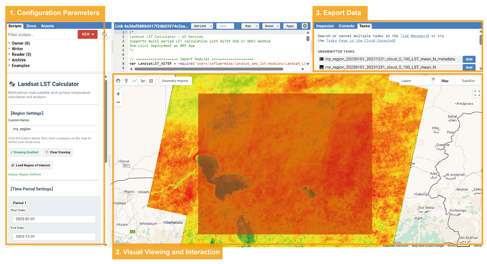

# GEE_app4LST

A Google Earth Engine-based Landsat Land Surface Temperature (LST) analysis and visualization tool that supports region of interest (ROI) selection, time range configuration, parameter settings, and result export functionality.

## Quick Start
1. Open this [Google Earth Engine link](https://code.earthengine.google.com/4a36ef5888d417f26b03974c2aa643a0).
2. Select ROI, time range, and run analysis according to the interface or picture prompts.
3. Export the data in the Tasks tab.