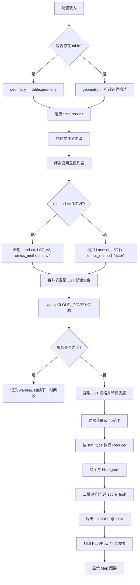

# Land Surface Temperature Batch Processing Script Documentation

## 1. 总览（Purpose & Architecture）
- **目标**：在多个自定义时间段内批量计算 Landsat LST，支持 ASTER GED 与 NDVI/FVC 发射率两种路径，解决 ASTER 数据缺失导致的区域空洞问题。
- **核心模块**：配置解析 → 研究区域解析 → 影像集合构建 → 云量与质量控制 → LST 估算与统计 → 可视化与导出。
- **外部依赖**：
  - `users/sofiaermida/landsat_smw_lst:modules/Landsat_LST.js`（ASTER）
  - `users/yyyh48201/GEE_landsat_lst:modules/Landsat_LST_v2.js`（NDVI/FVC）
  - 行政边界资产 `projects/ee-tilmacatanla/assets/boundry/*`

## 2. 配置阶段（Configuration Layer）
1. **时间段列表** `timePeriods`：数组驱动主循环，实现任意多时间窗口的串行处理。
2. **算法选择** `method`：`"ASTER"` → 使用 ASTER GED 发射率；`"NDVI"` → 使用 FVC 推导发射率。
3. **统计方式** `stat_type`：`mean`、`max`、`min`、`score_first`（基于云量评分的最优影像）。
4. **行政区域解析** `admin_config`：支持省/市/县或 `table` 自定义矢量。
5. **卫星启用矩阵** `satelliteConfig`：按卫星启停 L4/L5/L7/L8/L9。
6. **云量过滤** `cloud_min`~`cloud_max`：应用于 Landsat 原始 `CLOUD_COVER` 属性。
7. **导出元信息**：文件名由区域、日期范围、云量指标、统计方式与方法拼接组成。

## 3. 研究区域解析（Geometry Resolution）
- 优先读取外部变量 `table`，失败时按 `admin_config.level` 从中国行政边界资产过滤，获取 `geometry`。
- `layerDisplayName`：由 `table`/行政名称派生，提供地图图层标注。

## 4. 数据管线流程图

## 5. 影像集合构建与预处理
1. **模块入口**：`LandsatLST.collection(satellite, startDate, endDate, geometry, emissivityFlag)`
   - 针对 `"NDVI"` 方法传入 `'ndvi'`，否则布尔 `true`（ASTER）。
2. **集合合并**：
   - 逐卫星加载 TOA/TIR 与 SR，进行云掩膜、TPW 插值、NDVI/FVC/Emissivity 添加。
   - `LandsatColl` ← 多卫星集合并，统一拥有 `LST` 波段。
3. **云掩膜**：
   - SR 集合通过 `cloudmask.sr` 对 `QA_PIXEL` 做位掩膜，移除云/云影。
4. **云量评分** `calculateRegionCloudScore`：
   - 对 QA 位（L8+：bits 3/4/2；L4-7：BQA bits 4/3）求无云掩膜均值 → `score = mean(clearMask) × 100`。
5. **`score_first` 排序**：计算评分后按降序排序，`firstNonNull` 取最优影像。

## 6. 关键计算公式（Key Formulas）
1. **NDVI**（`compute_NDVI.js`）
   
   $$
   \mathrm{NDVI} = \frac{\text{NIR} - \text{Red}}{\text{NIR} + \text{Red}}, \quad \text{TOA reflectance} = \text{SR}_{\text{band}} \times 2.75\times10^{-5} - 0.2
   $$

   - L8/L9：`NIR=SR_B5`, `Red=SR_B4`；L4-7：`NIR=SR_B4`, `Red=SR_B3`。
2. **FVC**（`compute_FVC.js`）

   $$
   \mathrm{FVC} = \left( \frac{\mathrm{NDVI} - NDVI_{bg}}{NDVI_{vg} - NDVI_{bg}} \right)^2, \quad NDVI_{bg}=0.2, \ NDVI_{vg}=0.86,\ 0\le \mathrm{FVC} \le 1
   $$

3. **NDVI-based Emissivity**（`compute_emissivity_ndvi.js`）

   $$
   \varepsilon = 
   \begin{cases}
     0.97, & \mathrm{NDVI} < 0.0 \\
     0.97, & 0.0 \le \mathrm{NDVI} < 0.2 \\
     0.99, & \mathrm{NDVI} > 0.7 \\
     0.97 + (0.99 - 0.97)\cdot \frac{\mathrm{NDVI}-0.2}{0.5}, & 0.2 \le \mathrm{NDVI} \le 0.7
   \end{cases}
   $$

   - QA bit 7 → 水体 emissivity=0.99；bit 5 → 雪冰=0.989。
4. **TPW 插值**（`NCEP_TPW.js`）

   $$
   \text{TPW} = \text{TPW}_1 \cdot t_2 + \text{TPW}_2 \cdot t_1,\quad
   t_i = \frac{|t_{\text{image}} - t_i|}{6\text{h}}
   $$

   - 并根据 TPW 将像元映射至 `TPWpos` 的 0–9 桶。
5. **Statistical Mono-Window (SMW) LST**（`SMWalgorithm.js`）

   $$
   \text{LST} = \frac{A \cdot T_{b}}{\varepsilon} + \frac{B}{\varepsilon} + C
   $$

   - `A,B,C`：由 `TPWpos` 查表获得；`T_b`：对应卫星 TIR 波段（L8/9→B10；L7→B6_VCID_1；L4/5→B6）。
6. **温度转换**：

   $$
   \text{LST}_{\text{°C}} = \text{LST}_{\text{K}} - 273.15
   $$

7. **异常值过滤（Z-Score）**：

   $$
   z = \frac{\text{pixel} - \mu}{\sigma},\quad \text{保留 } |z| \le 4
   $$

   - `μ, σ`：`lst_mean.reduceRegion` 得到的区域均值/标准差。
8. **云量评分输出**：

   $$
   \text{CloudScore} = \text{mean(clearMask)} \times 100 \quad (0-100)
   $$

## 7. 时间段处理循环
- 对每个 `timePeriod`：
  1. 构建 `filename`（包含区域、日期范围、云量、统计方式、方法标签）。
  2. 拉取启用卫星集合 → 合并 → LST 波段裁剪。
  3. 空集合则返回 `error` 字典，主循环继续。
  4. 单位转换、异常值掩膜、排序、reduce（mean/max/min/firstNonNull）。
  5. 绘制直方图：
     - 定义区间 `[-30, 60)`，宽度 2°C。
     - `count = resultLST.mask(range).sum(scale=900m)` → FeatureCollection → `ui.Chart`。
  6. 结果图层：`Map.addLayer(resultLST, palette=['blue','cyan','green','yellow','red'])`。

## 8. 元数据收集与导出
- **Path/Row 统计** `createPathRowList`：返回去重后的 `WRS_PATH/ROW` 列表，便于下载计划。
- **影像表格**：
  - 使用 `LandsatColl.evaluate` 获取客户端列表 → 构建 CSV 字段：序号、ID、CLOUD_COVER、DATE_ACQUIRED、SCENE_CENTER_TIME(UTC/北京)。
  - `calcBeijingTime()`：UTC → UTC+8。
- **导出**：
  - `Export.image.toDrive`：扩展 5 km 缓冲区，30 m 分辨率，GeoTIFF。
  - `Export.table.toDrive`：Landsat 元信息 CSV。
- **界面展示**：
  - 直方图、云量评分打印，Path/Row 排序输出。
  - 研究区边界 `Map.addLayer(geometry, boundary_style/默认红色轮廓)`。

## 9. ASTER 与 NDVI 方法差异

| 环节 | ASTER (`method='ASTER'`) | NDVI (`method='NDVI'`) |
| --- | --- | --- |
| 发射率来源 | `compute_emissivity.js`，依赖 ASTER GED 栅格 | `compute_emissivity_ndvi.js`，由 NDVI/FVC 推断 |
| 输入要求 | 需要完整的 ASTER GED 覆盖 | 无 ASTER 依赖，对全球 NDVI 数据鲁棒 |
| 接口调用 | `Landsat_LST.collection(..., true)` | `Landsat_LST_v2.collection(..., 'ndvi')` |
| 缺失处理 | ASTER 缺失处 LST 常留空 | NDVI 方案填补多数缺失区域 |

## 10. 模块解耦与可扩展性建议
- **配置解耦**：将 `timePeriods`、`satelliteConfig`、`admin_config` 拆至外部 JSON，实现脚本参数化。
- **方法扩展**：`Landsat_LST_v2` 已统一入口，可添加新的 emissivity 方案（例如基于夜间 LST）。
- **云量策略**：`calculateRegionCloudScore` 可替换为 QA 位计分或像素级统计，便于接入 Sentinel-3 等新数据。
- **异常值规则**：目前 ±4σ 固定，可改成基于 IQR 或自适应阈值。
- **输出自动化**：结合 `ExportTaskManager`（Earth Engine Apps）批量监控任务，或写成服务器端 `ee.batch.Export` 调度。

---

完成上述技术拆解，可帮助快速理解脚本逻辑、定位扩展点，并在缺失 ASTER 数据的区域部署 NDVI/FVC 发射率方法。
